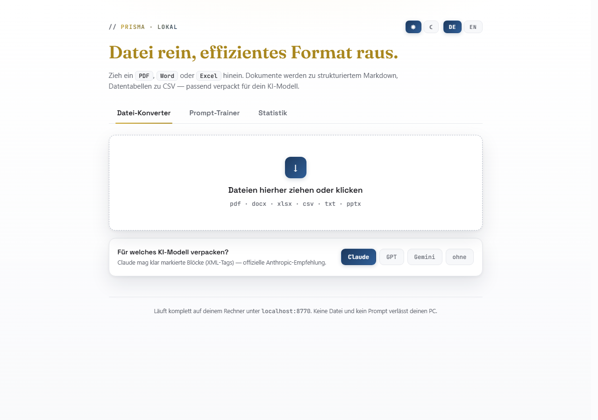
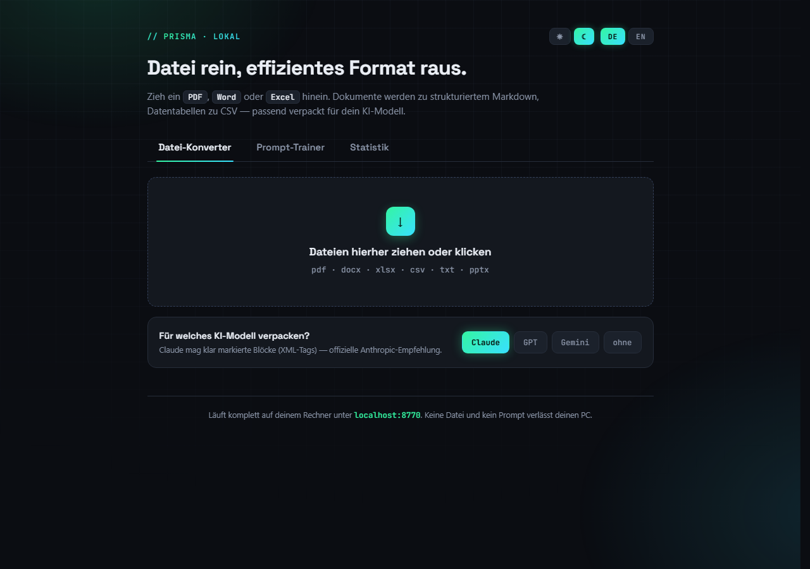
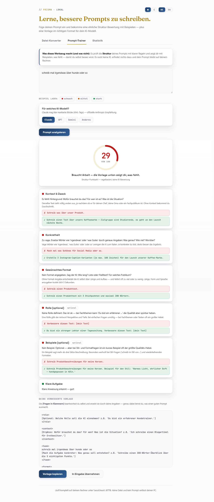
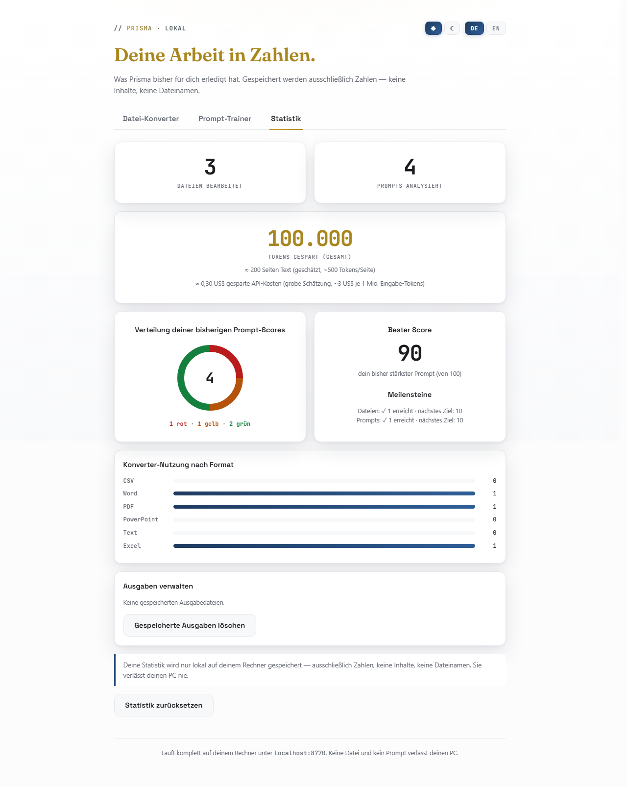

# Prisma

🌐 **English** · [Deutsch](README.de.md)


Prisma is a local browser UI with three tools for working with AI models: a **file converter** that turns PDF, Word, Excel, CSV, TXT and PowerPoint into token-efficient formats, a **prompt trainer** that rates the structure of your prompts with transparent rules and helps you learn, and a **statistics** tab that shows your savings. **Everything runs entirely on your machine** — there is not a single external connection; no file and no prompt ever leaves your PC. A dedicated test (`tests/test_privacy.py`) proves this on every test run.

| Light theme (default) | Dark theme |
|---|---|
|  |  |

| Prompt Trainer | Statistics |
|---|---|
|  |  |

## What the tools do

1. **File Converter**: prose becomes Markdown, tables become CSV — wrapped to fit your AI model (Claude → XML tags, GPT → Markdown sections, Gemini → clear structure). Image PDFs and mixed PDFs (text + scans) are detected automatically and processed with **OCR**, page by page, so nothing gets lost. The result bar with download, **"Open folder"**, copy and "New file" stays visible while scrolling.
2. **Prompt Trainer**: rates the **structure** of a prompt with transparent rules (deliberately **no AI**), shows a score (0–100) with a traffic light, explains every check with ✗/✓ examples and builds a model-specific template with [placeholder questions] you fill in yourself — that's exactly how you learn. With demo buttons and a learning loop.
3. **Statistics**: files processed, prompts analyzed, tokens saved (with page and cost estimates, clearly labelled as estimates), score distribution, milestones, format usage — plus a "Manage outputs" section for cleaning up.

**Languages:** German and English UI (toggle in the top right, the choice is remembered). The Prompt Trainer additionally detects your prompt's language and builds the template in that language.

**Design:** two themes, toggled in the top right (☀/☾): light (editorial style, default) and dark ("neon workshop"). Your choice is remembered.

## Installation (Windows)

Requires [Python 3.12](https://www.python.org/downloads/) (check "Add python.exe to PATH" during setup). Developed and tested on Python 3.12; earlier versions are untested.

**Easiest:** double-click `install.bat` (once).
**Manually:** `pip install -r requirements.txt`

> **Note on the Windows security warning:** on first launch of `install.bat`/`start.bat`, Windows may show "Unknown publisher". This is normal for unsigned scripts — click "More info" → "Run anyway". The full source code is right here in this folder.

### OCR for image PDFs (optional)

PDFs consisting only of scanned pages need two extra programs (one-time):

```powershell
winget install -e --id UB-Mannheim.TesseractOCR
winget install -e --id oschwartz10612.Poppler
```

Prisma finds both automatically in the usual install locations — no PATH entry needed. **Text PDFs and all other formats work without OCR.** If a dependency is missing, nothing crashes: instead of a result, the app returns clear step-by-step instructions on what to install.

## Start

Double-click `start.bat` (the browser opens automatically) or:

```powershell
python app.py
```

Then open **http://localhost:8770** — quit with `Ctrl + C`. The server runs on port 8770 and binds to 127.0.0.1 only; it is not reachable from the network.

## Where do the results go?

Every conversion result is stored in the project folder under `outputs/` — the **"Open folder"** button (in the result bar and in the stats tab under "Manage outputs") takes you straight there.

The browser download ("Download file") is an **additional copy**; where it is saved is controlled by a **browser setting**, not by Prisma — a local web app cannot choose the download location. If you want a fixed target folder: set the download location in your browser settings or disable "Ask where to save each file".

## Privacy

- **No external connections.** Even the fonts are bundled locally (`static/fonts/`). The test suite `tests/test_privacy.py` loads the page with the internet fully blocked and fails if any external request is even attempted.
- **Statistics store nothing but numbers** — locally in `stats.json`: no content, no file names, no prompt texts. Resettable to zero in the stats tab at any time.
- **Conversion results** are stored unencrypted in the `outputs/` folder (so downloads keep working later). The "Manage outputs" section in the stats tab deletes them all at any time. Uploaded originals are removed immediately after conversion; leftovers from a hard crash are cleaned up on the next server start.

## Honesty & known limitations

The promise is not "nothing is ever lost" but: **nothing is lost silently.** Whatever cannot be extracted is named in the result note. Inherent limits: Word footnotes/text boxes and embedded PDF images are not carried over (the app tells you), Excel formulas without a cached result appear as the formula string, the converter's result notes are deliberately still German-only, and token counting without `tiktoken` is a declared estimate.

## Tests

127 tests in 12 suites that construct their own test files (additionally required: `reportlab`, `playwright`). All except the first two need the server running (`python app.py`):

```powershell
python tests/test_block1.py        # Converter core (PDF/DOCX/XLSX/PPTX)
python tests/test_block2.py        # Prompt Trainer (rules + calibration)
python tests/smoke_http.py         # Endpoint smoke incl. statistics
python tests/test_block3_dom.py    # Browser UI (language, demos, learning loop)
python tests/test_blockB_dom.py    # Themes + WCAG contrasts
python tests/test_blockC_stats.py  # Statistics backend (numbers only, atomic, origin)
python tests/test_blockC_dom.py    # Statistics UI + counting rules + output management
python tests/test_blockD_dom.py    # Layout stability + converter reset
python tests/test_privacy.py       # Zero external connections (proof)
python tests/test_blockG_dom.py    # Result bar + open-folder button
python tests/test_blockH_dom.py    # Error display (clear message + collapsible detail)
python tests/test_pdf_robust.py    # PDF robustness (bounding-box artifacts, page-wise OCR)
```

## License

The code is **MIT**-licensed — see [LICENSE](LICENSE). The bundled fonts (Space Grotesk, JetBrains Mono, Fraunces) are licensed under the **SIL Open Font License**; the license texts live in `static/fonts/`.
